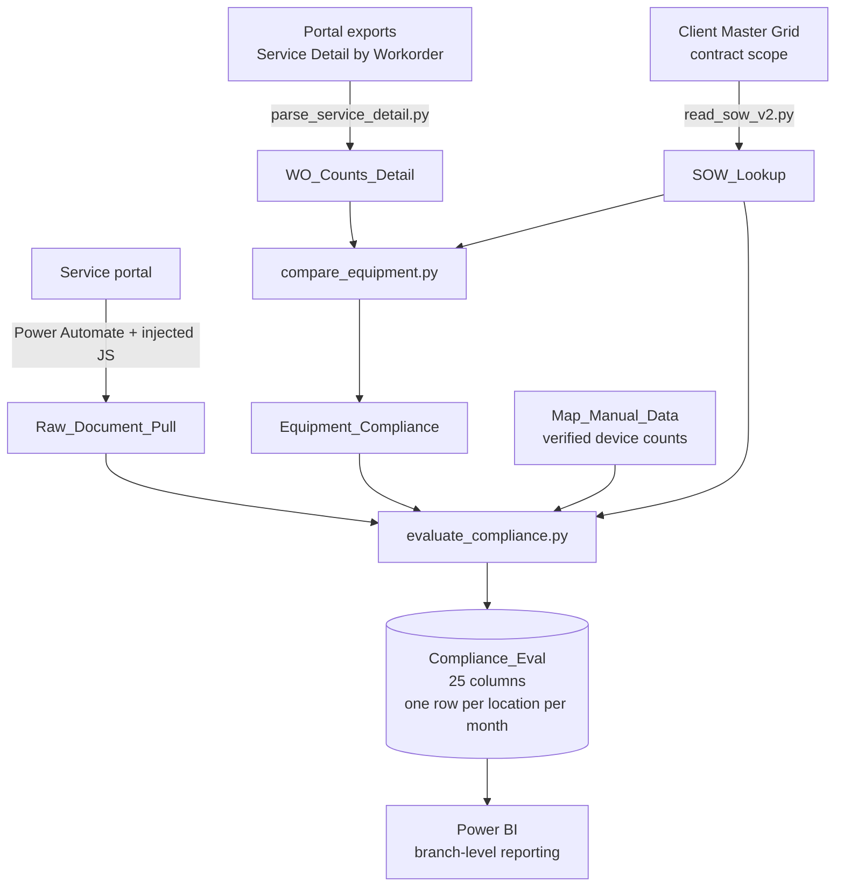

# Compliance Automation Pipeline

An end-to-end automation pipeline that replaces a manual monthly compliance audit across **319 service locations** for two national accounts.

Three independent data streams — scraped documents, work-order exports, and contract scope — are reconciled against each other and reduced to one row per location per month, with a verdict per check rather than a single pass/fail per site.

Built independently, from scratch, while learning Power Automate and Python.

> **A note on names.** Client and employer names are genericized throughout this repository. "Client A" and "Client B" are two national food & beverage accounts; "the portal" is a proprietary service-management platform. No client data, credentials, addresses, portal URLs, or documents appear anywhere in this repository.

---

## The problem

Every service location must hold current compliance documentation at all times — eight distinct items, some belonging to a specific technician, some valid only for the current year or quarter:

| # | Document | Scope |
|---|---|---|
| 1 | Branch pest control business license | Branch-level |
| 2 | Certificate of Insurance (COI) | Branch-level |
| 3 | Technician pesticide license | Per technician |
| 4 | Technician client certification | Per technician |
| 5 | IPM / cGMP certification | Per technician, current year |
| 6 | Annual facility assessment | Per location, current year |
| 7 | Quarterly pest trend report | Per location, current quarter |
| 8 | Quarterly pesticide usage log | Per location, current quarter |

At 319 locations × 8 checks, that is **2,552 document verifications per month**. The original process was one person reading them line by line in Excel and emailing each branch individually.

Documents were only half the problem. Each location also has a contracted device count and service frequency, and verifying that a technician actually serviced the right number of devices the right number of times required reconciling work-order exports against a contract grid by hand — a step that was, in practice, rarely done at all.

---

## Architecture

Three streams, joined on a normalized address key.



| Stream | Source | Depends on the portal UI? |
|---|---|---|
| Documents | Power Automate scrape of the Licenses and QA tabs | Yes |
| Work orders & equipment | Raw "Service Detail by Workorder" exports | No |
| Contract scope & maps | Client Master Grid, plus manually verified map counts | No |

Only the document stream touches the portal's interface. That separation is deliberate: when the portal was rebuilt on a new front-end framework, work-order and equipment reporting kept running untouched while the scraper was repaired.

Every script normalizes addresses in memory before matching — uppercase, street portion only before the first comma, prefix text dropped up to the first street-number token, and standardized suffixes (`ROAD`→`RD`, `STREET`→`ST`). All four tabs collapse to the same join key.

---

## Scale

| Item | Value |
|---|---|
| Client A locations | ~131 |
| Client B locations | ~188 |
| Total locations | 319 |
| Document checks per location | 8 |
| Device types reconciled | 3 |
| Output columns per location per month | 25 |
| Automation flows | 2 (one per client) |
| Locations requiring manual review by design | ~17 |
| Run cadence | Monthly |

---

## What gets checked

### 1. Documents

Eight checks per location. Each returns a verdict, not a boolean, because "missing" and "present but unverifiable" are different problems requiring different follow-up.

| Verdict | Meaning |
|---|---|
| `PASS` | Found, valid, correct technician and year where those apply |
| `MISSING` | No matching document found |
| `EXPIRED` | Expiration date has passed as of the audit month end |
| `WRONG_YEAR` | Found, but carries an explicit year that is not the target |
| `MANUAL_REVIEW` | Found, but technician, date, or title is ambiguous |
| `EXEMPT` | Does not apply — franchise location or state exception |

Quarter matching is inferred, not assumed. A title carrying a quarter keyword but no year is resolved against the document's inspection date, with a specific rule for the common case: a Q4 report uploaded in January through March covers Q4 of the *previous* year.

### 2. Equipment

Per location, per month, per device type — exterior rodent bait stations (ERB), interior rodent traps (IRT), and insect/fly light traps (IFL).

Scanned counts are compared against `devices × visits-per-month` from the contract:

| Verdict | Condition |
|---|---|
| `PASS` | Scanned count is 95–110% of expected |
| `UNDER (n short)` | Below 95%; `n` is how many scans short |
| `OVER (~Nx, expected Mx)` | Above 110%; shows actual visits per device against contracted |
| `EXTRA DEVICE` | Scans found a device type the contract says is not on site |
| `CANCELLED` | Location marked cancelled in the contract grid |
| `NO SOW` | No contract row to compare against |
| `NO WORK ORDERS` | Contract row exists, but no work orders this period |
| `N/A` | None expected, none scanned |

### 3. Maps

Manually verified floor-plan device counts compared against contracted counts, to catch scope drift.

| Verdict | Meaning |
|---|---|
| `MATCH` | All verified map counts equal contracted device counts |
| `MISMATCH` | At least one differs; detail names the device type and both numbers |
| `NO_MAP` | No map on file, or counts not yet entered |
| `NO_SOW` | No contract row for this address |

---

## Reporting layer

`Compliance_Eval` appends rather than overwrites, so the output accumulates one row per location per month. That history is what the reporting layer reads.

**The model is a star schema.** Three conformed dimensions — `Dim_Month`, `Dim_Address`, and `Dim_DeviceType` — sit over four fact tables: document compliance, work-order counts, map verification, and equipment compliance. Dimensions carry explicit sort-order columns so months and device types sort logically rather than alphabetically. Building dimensions rather than loading one flat table is what lets a single slicer filter every visual on the page consistently.

Two pages, sliced by month, branch, and address:

| Page | Answers |
|---|---|
| **By Branch** | How is this branch doing overall, and which of its locations need attention? |
| **By Address** | For this one location this month: what is wrong, and what do I do about it? |

**Every status is paired with the action that clears it.** This is the design decision the whole report is built around. A missing document is not reported as `MISSING` and left there — it appears in an *Action Items* table as `Upload: Certificate of Insurance`. An equipment shortfall is not reported as `UNDER` — it reads `ERB: 5 of 6 scans (83% of monthly target)`. A map discrepancy shows the contracted count, the verified count, and the gap between them, side by side.

The audit already knew all of this. The reporting layer's job is to state it as an instruction rather than a status code, because the recipient is a branch manager who needs to know what to do, not an auditor reading verdicts.

**Percentages are DAX measures, not stored columns.** Both document compliance and equipment compliance are calculated in the model rather than written into the pipeline output. A measure has one definition, evaluates against whatever the slicers currently select, and can be corrected without re-running the pipeline or rebuilding history. A stored percentage is frozen at the grain it was written at and goes stale the moment the definition changes.

**A limitation worth naming:** access is currently handled by distributing separate reports rather than by a row-level security rule inside the model. Row-level security is the correct fix — one report, filtered per viewer by identity — and is the natural next step. Distribution works, but it scales with the number of branches instead of staying constant.

---

## The rewrite

The pipeline was rewritten in mid-2026 after the first version produced results that could not be trusted. What changed, and why:

| Area | Before | After |
|---|---|---|
| Work-order counts | Manual paste into a page tab, then Power Query | `parse_service_detail.py` reads raw exports directly |
| Equipment compliance | `MATCH` / `MISMATCH` — binary, and usually wrong | `PASS` / `UNDER` / `OVER` / `CANCELLED`, per device type |
| Technician name | A helper script, a lookup workbook, and a manual paste | Read directly from `WO_Counts_Detail` at runtime |
| **Contract counts** | **Derived from work-order data** | Read from the client Master Grid |
| Map vs contract | Computed internally, then discarded | 7 columns in the output with full mismatch detail |
| Cancelled locations | Skipped silently — surfaced as "missing" | Explicit `CANCELLED` marker, flows through as exempt |
| Output behavior | Wiped and rewritten every run | Appends, preserving history for trend reporting |

Two of those are worth dwelling on.

**The contract counts were derived from work-order data.** Which means the equipment check was comparing the work-order data against itself and reporting agreement. It could never have found a discrepancy. Reading contract scope from an independent source — the client's own Master Grid — is what made the check mean anything.

**Binary verdicts were wrong by construction.** A location servicing 54 devices weekly produces roughly 216 scans a month, so any exact-match test fails permanently. Replacing the boolean with a tolerance band and a direction turned a report nobody trusted into one a branch manager can act on: not just *whether* a location is off, but *how far* and *which way*.

---

## Key engineering decisions

**Verdicts, not booleans.** Applied to every check in the system. `UNDER (14 short)` tells a branch manager what to do; `MISMATCH` does not.

**`MANUAL_REVIEW` as a first-class outcome.** A document that exists but cannot be confidently attributed to the right technician or year is not the same as a missing document, and collapsing the two produces a report nobody trusts. Ambiguity gets its own verdict and its own flag text naming the specific document that caused it. Roughly 5% of rows land here by design, which is what makes the other 95% worth trusting.

**Zone-based device classification.** Device type names in the source data are unreliable — a "Glue Board" may be an insect monitor or an interior rodent device depending on where it is installed. Classification uses the zone description as a tiebreaker, with an explicit exterior designation winning over an interior keyword, since the outdoor label is the more specific claim. Anything still genuinely unclear is flagged, never guessed.

**Deduplication at two levels.** Devices are deduplicated by barcode within a work order, so a station scanned twice does not inflate the count. Work orders are deduplicated by ticket number across files, so overlapping date-range exports can be dropped in the same folder safely.

**Service-activity filtering.** Only recurring standard service counts toward equipment compliance. A first service is ignored at an existing address — it is an add-on — but kept at an address never seen before, and flagged as needing contract setup.

**Fuzzy address matching, with the fuzziness disclosed.** Addresses that do not match exactly fall back to a similarity ratio with a 0.90 cutoff. Any row matched this way carries a flag naming what it matched to, so a human confirms it rather than discovering it later.

**Scraping by heading text, not element position.** Injected JavaScript locates tables by their heading text rather than by position in the DOM. Position-based selectors broke on every portal update; heading-based ones survived a full front-end rebuild.

**Typo normalization before matching.** Document titles are free text entered by branch staff. A correction dictionary fixes 47 known misspellings (`LISENSE`, `CERTFICATE`, `PESTICLDE`) before any keyword matching runs.

**Trusting the title over the metadata, selectively.** Portal expiration dates are wrong roughly 15% of the time. For insurance certificates, an explicit year in the document title is trusted ahead of the recorded expiration date, with the date as fallback. A measured decision about which source lies less often, not a general rule.

**Temp files as the hand-off layer.** Power Automate cannot reliably pass variables to Python as command-line arguments — special characters in addresses break it. Every hand-off goes through a temp file, and every reader is encoding-tolerant, because Power Automate is inconsistent about whether it writes UTF-8, UTF-8-with-BOM, or UTF-16.

**History is preserved, not overwritten.** The document tab replaces only rows pulled for the same address on the same day; prior days stay. The output tab appends. Day-over-day portal discrepancies stay visible instead of being silently flattened.

**OCR abandoned deliberately.** Optical character recognition was tested for reading device counts off floor-plan PDFs and produced unreliable results across hand-drawn, scanned, and digital maps. It was replaced with one-time manual verification. Being able to say why a technique was rejected is worth more than a feature that quietly returns wrong numbers.

---

## Repository structure

```
scripts/
  evaluate_compliance.py   Everything → Compliance_Eval (the master evaluation)
  write_to_excel.py        Per-location scrape → Raw_Document_Pull
  get_drop_number.py       Resolves locations returning multiple portal results
  move_map.py              Renames and files downloaded map PDFs by address

docs/
  project_overview.md      Plain-English explanation of the whole system
  data_flow.md             How data moves from portal to final report
  automation_flow.md       Step-by-step walkthrough of the Power Automate flow
  excel_structure.md       Every tab and column in both workbooks
```

**Not published here, and why.** The equipment reconciliation modules (`parse_service_detail.py`, `compare_equipment.py`, `read_sow_v2.py`) are described throughout this README but are not included. Neither are the Power Automate flow files, which contain portal URLs, UI selectors, and environment-specific configuration for a live customer system.

---

## How it runs

| Order | Script | Trigger | Behavior |
|---|---|---|---|
| — | `read_sow_v2.py` | Manual, only when contract scope changes | Rebuilds `SOW_Lookup` from the Master Grid |
| Per location | `get_drop_number.py` | Auto, start of each location | Writes the correct search-result index to a temp file |
| Per location | `move_map.py` | Auto, when a map PDF downloads | Renames and files the PDF by address |
| Per location | `write_to_excel.py` | Auto, after each scrape | Appends to `Raw_Document_Pull` |
| 1 | `parse_service_detail.py` | Auto, post-loop | Rebuilds `WO_Counts_Detail` |
| 2 | `compare_equipment.py` | Auto, post-loop | Rebuilds `Equipment_Compliance` |
| 3 | `evaluate_compliance.py` | Auto, post-loop | Writes `Compliance_Eval` |

Steps 1–3 run standalone from the command line without re-scraping, which makes a mid-month equipment check cheap.

### Monthly runbook

1. Export the "Service Detail by Workorder" report for both clients into the raw data folder. Filenames must begin with the client prefix; anything after it is free.
2. If contract scope changed, update the Master Grid and run `read_sow_v2.py` once.
3. Set `AUDIT_MONTH` at the top of `evaluate_compliance.py`.
4. Fill in map device counts for any new locations in `Map_Manual_Data`.
5. Close Excel completely — not minimized. `openpyxl` cannot write to an open file.
6. Run the flow overnight. Do not use the computer while it runs; Power Automate controls the browser, keyboard, and mouse.
7. Review `Equipment_Compliance` filtered to `UNDER`, `OVER`, `CHECK`, and `NO WORK ORDERS`.
8. Review `Compliance_Eval` filtered on the `flags` column.

---

## Known constraints

| Constraint | How it is handled |
|---|---|
| Power Fx cannot be disabled on these flows | Numbers need an `=` prefix; variables must be inserted with the `{x}` picker, never typed |
| Power Automate cannot pass variables to Python reliably | All hand-offs go through temp files |
| Inconsistent encoding from Power Automate-written files | Readers try UTF-8-BOM, UTF-16, then Latin-1 in turn |
| Address spelling drift across systems | In-memory normalization in every script, plus fuzzy fallback with a verify flag |
| Portal UI updates break recorded clicks | JavaScript steps target elements by heading text; recorded UI steps are re-recorded when they break |
| ~17 locations return multiple portal search results | Written as a `MANUAL_REVIEW` marker by design; a dedicated flow for these is deferred |
| Cloud sync causes file-lock errors during overnight runs | All working files live on a local path, never in a synced folder |

---

## Status

| Component | Status |
|---|---|
| Client A automation flow | Running |
| Client B automation flow | Running |
| Work-order and equipment pipeline | Running |
| Document scrape and compliance scoring | Running |
| Map comparison | Running (counts manually verified) |
| Power BI reporting layer | Running |
| Row-level security in the Power BI model | Not implemented — access handled by distribution |
| Multi-drop location automation | Deferred |

---

## Tools

| Tool | Purpose |
|---|---|
| Power Automate Desktop | Browser automation and portal navigation |
| Python 3 | Parsing, reconciliation, evaluation |
| JavaScript | Injected into the portal to scrape page tables |
| openpyxl | Excel reads and writes |
| Excel | Central data store |
| Power BI | Branch-level reporting off the monthly output |

---

## Author

**Savanna Mullins** — designed and built independently as a self-initiated project outside of a formal engineering role.
